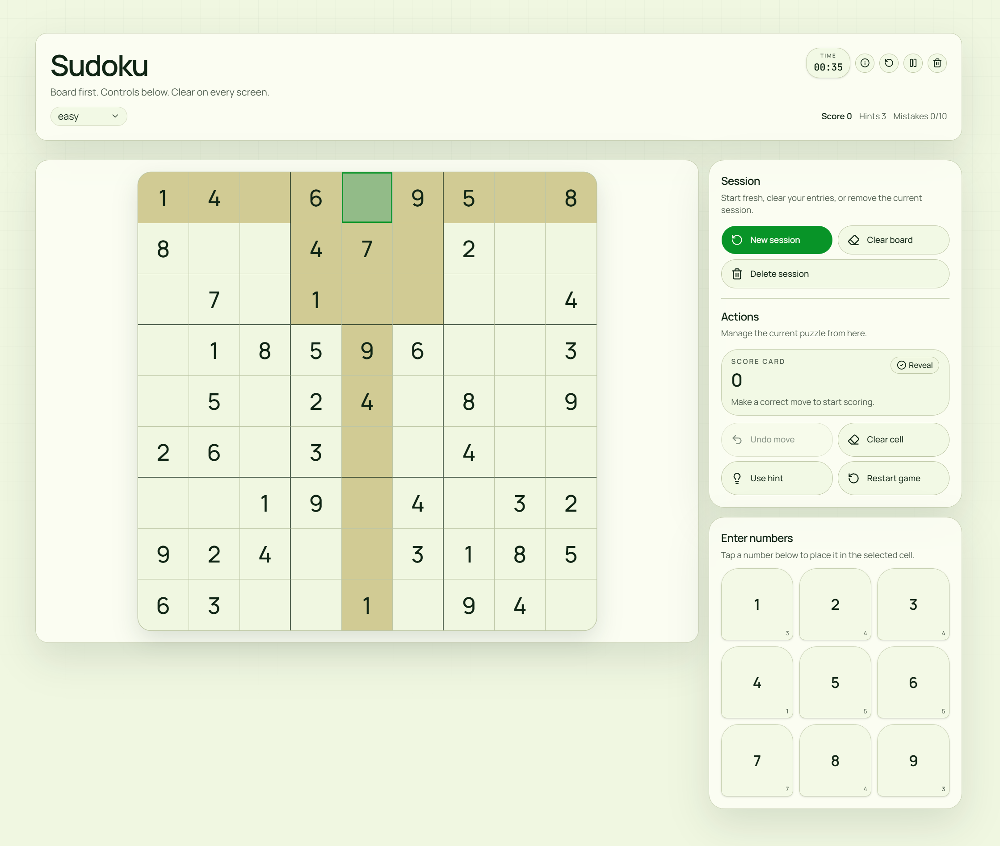

# Sudoku

A polished web-based Sudoku game built with Next.js, React, TypeScript, and Tailwind CSS.

This project focuses on a clean play experience: responsive board layout, keyboard-friendly controls, score tracking, mistake limits by difficulty, hints, undo, and a distinct visual theme for each session.



## Highlights

- 9x9 Sudoku gameplay with generated puzzles and full solutions
- Four difficulty levels: `easy`, `medium`, `hard`, and `expert`
- Unique-solution puzzle generation
- Score system with rewards for correct moves and completion bonuses
- Penalties for wrong moves and hint usage
- Mistake limits that scale with difficulty
- Up to 3 hints per game
- Undo support for previous moves
- Restart, clear-board, new-session, and delete-session flows
- Reveal-solution action with confirmation dialog
- Keyboard support for number entry, deletion, undo, and board navigation
- Conflict highlighting for invalid entries
- Number pad with remaining-count indicators
- Responsive layout optimized for mobile and desktop
- Randomized session themes and typography variants
- Toast feedback and modal dialogs for major actions

## Gameplay Features

### Difficulty system

The game currently supports these puzzle profiles:

| Difficulty | Removed cells | Mistake limit |
| --- | ---: | ---: |
| Easy | 36 | 10 |
| Medium | 46 | 5 |
| Hard | 52 | 3 |
| Expert | 58 | 2 |

### Scoring

Players earn points for correct moves and receive extra bonuses when they finish larger sections of the board.

- Base points per correct move:
  - `easy`: 150
  - `medium`: 180
  - `hard`: 250
  - `expert`: 250
- Bonuses:
  - `+50` for completing a row
  - `+50` for completing a column
  - `+100` for completing a 3x3 box
  - `+500` for completing the full puzzle
- Penalties:
  - `-30` for a wrong move
  - `-75` for using a hint

### Controls

#### Mouse / touch

- Select any cell on the board
- Tap a number in the number pad to place it
- Use the action buttons for undo, clear, hint, restart, reveal, pause, or session actions

#### Keyboard

- `1-9`: place a number in the selected cell
- `Backspace`, `Delete`, or `0`: clear the selected cell
- `Ctrl+Z` / `Cmd+Z`: undo the last move
- Arrow keys: move selection around the board

## Tech Stack

- Next.js 16
- React 19
- TypeScript
- Tailwind CSS 4
- shadcn/ui
- Lucide React
- Sonner

## Project Structure

```text
src/
  app/
    globals.css        Global styles, themes, typography, layout tokens
    layout.tsx         App shell, metadata, fonts, session theme bootstrap
    page.tsx           Home page entry point
  components/
    session-theme.tsx  Random per-session visual theme handling
    sudoku/
      board.tsx        Board rendering and cell interaction UI
      game.tsx         Main gameplay state and rules
      number-pad.tsx   Number pad with remaining-count display
    ui/                Reusable UI primitives
  lib/
    sudoku.ts          Puzzle generation, solving, validation, helpers
    utils.ts           Shared utility helpers
```

## Getting Started

### Prerequisites

- Node.js 20+ recommended
- `pnpm` recommended for dependency management

### Install

```bash
pnpm install
```

### Run the development server

```bash
pnpm dev
```

Open `http://localhost:3000` in your browser.

### Production build

```bash
pnpm build
pnpm start
```

### Lint

```bash
pnpm lint
```

## Available Scripts

| Script | Description |
| --- | --- |
| `pnpm dev` | Start the local development server |
| `pnpm build` | Build the production app |
| `pnpm start` | Run the production server |
| `pnpm lint` | Run ESLint |

## Implementation Notes

- Puzzles are generated in-app and checked to ensure exactly one solution.
- Conflict states are highlighted immediately when a placement breaks Sudoku rules.
- The board supports pause mode, win/loss dialogs, and explicit confirmation before destructive session actions.
- Session appearance is randomized using `sessionStorage`, so each session can load with a different theme/font combination.

## Current Scope

This repository currently includes:

- Single-page Sudoku gameplay experience
- Client-side puzzle generation and validation
- Local session appearance handling

This repository does not currently include:

- Authentication
- Cloud saves or cross-device sync
- Multiplayer
- Automated test suites

## Author

Built by [Ankur Jaiswal](https://github.com/ankurjaiswalofficial).
